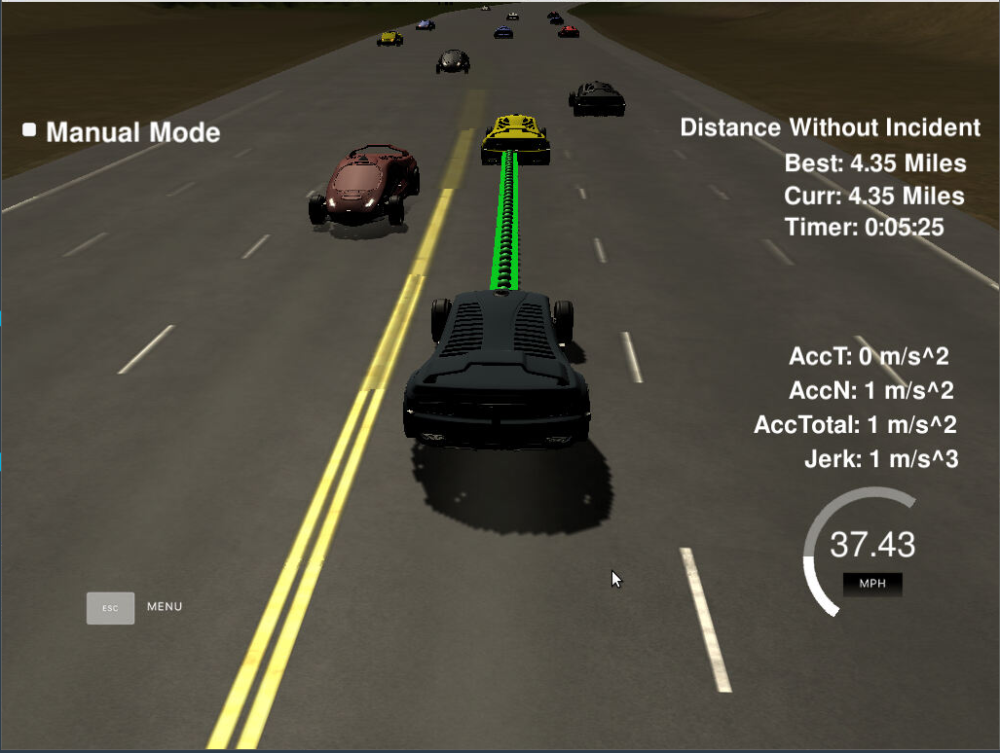

# Model Documetation

## Structure
The code for the path planner is executed in three main steps:

1. Predict
2. Decide
3. Generate Trajectory

The prediction step covers analyze nearby traffic and predicting where it will be
safest/most effective to move next.

The decision step analyzes the results of the predicions and chooses a course of action.

The trajectory generation uses the car's current localization and previous path information
to spline together a path. This step further checks the vehicles acceleration and speed
to ensure a safe, comfortable ride.

### Method
This model was implemented primarily through a class called Vehicle.
This class contained information about the car's position, speed, and trajectory
and served as a container for the results of intermediate calculations in producing
the final trajectory.



## Prediction

The code for predicting the behavior of nearby traffic is found in the `Vehcile::Predict`
function of the vehicle class.

This function loops through input sensor_fusion data for each vehicle on the road.
By instantiating a Vehicle object, a convenient container is created for tracking
the different cars' parameters.

In each case, the main car determines which lane the other vehicle is in and if that
vehicle provides any limits on the car's ability to move ahead at the speed limit or
to change lanes.

This is, essentially, a finite state machine which examines a predefined set of possible
next states. This is a limited mechanism as there are occasions when the main car may
get stuck in a slow lane. For example, by only check the next lane(s) over, the car
misses opportunities to pass traffic by slowing down, getting behind a car in the next
lane over, and switching lanes again to get ahead of the traffic.

## Decision

A decision is made by the vehcile in the `Vehicle::choose_action` function in the Vehicle
class. This function reads the booleans set by prediction and determines if the car should
keep moving forward at the speed limit, keep moving forward at the speed of traffic,
change lanes left and match the speed of traffic there, or change lanes right and match the
speed of traffic. A call to `Vehicle::adjust_speed` sets the vehicle's jerk to the appropriate limiting value.


## Trajectory Generation

Trajectory generation is implemented in the `Vehicle::generate_trajectory` function in the
Vehicle class. A trajectory takes its first few values from the previous trajectory's last few values, to ensure path continuity. Then a serious of waypoints are added to the trajectory. These are calculated based on the car's target lane. Three such points in the given lane are computed at evenly spaced intervals.

These points are splined together to create a template of the trajectory (using utilities found in the `spline.h` file in the `include/` directory).

A target distance x, is defined as the car's ultimate target for the trajectory. This x corresponds to a horizontal distance straight ahead of the car. The corresponding targeted y distance is calculated from the spline.

#### _Spline and Point Generation_
```
//Use spline to compute trajectory function
tk::spline s;
for(int i=1;i<ptsx.size();i++){
  //cout << "X: " << ptsx[i] << " , Y: " << ptsy[i] << endl;
  if(ptsx[i] == ptsx[i-1]){
    ptsx[i] += 0.1;
  }
}

s.set_points(ptsx, ptsy);

/*
....
*/

//Compute next trajectory point
double N = target_dist / (0.02 * (ref_vel/2.24));	//2.24 to get vel from mph to mps
double x_point = x_add_on + (target_x)/N;
double y_point = s(x_point);

x_add_on = x_point;
double x_ref = x_point;
double y_ref = y_point;

//Translate/rotate back from car's coordinates
x_point = (x_ref * cos(ref_yaw) - y_ref*sin(ref_yaw));
y_point = (x_ref * sin(ref_yaw) + y_ref*cos(ref_yaw));

x_point += ref_x;
y_point += ref_y;
```

To the original path is appended points which are evenly spaced along the car's horizontal axis. Each of these points gets its y-value from the same spline curve. Finally, these points are transformed back into the map coordinate frame before being passed into the simulator.

Acceleration and velocity are checked at each point on the trajectory to ensure that neither exceeds the maximum allowed values. Furthermore, once target velocities are achieved, the car's acceleration and jerk are both reset. This seems to work well enough in the simulator, but does not guarantee, in other systems, a safe and comfortable trajectory. Futhermore, the kinematics are not as precise as could be, but were done to extrapolate a constanct velocity, acceleration, and jerk over each interval to prevent overly complicated computations with large numbers (eg. 10 m/s^3 ~ 2.9E7 mi/h^3).

#### _Kinematic Updates_
```
//Update acceleration
ref_acc += ref_jerk * 0.02;
if(ref_acc >= ACC_LIMIT){
  ref_acc = ACC_LIMIT-0.5;
}
else if(ref_acc <= -ACC_LIMIT){
  ref_acc = (-ACC_LIMIT)+0.5;
}
//Update velocity
ref_vel += (0.02 * ref_acc)*2.24;	//2.24 to get vel in mph from mps
if((abs(ref_vel - target_speed)/2.24) <= (0.02*ACC_LIMIT)){
  ref_vel = target_speed;
  ref_acc = 0.0;
  ref_jerk = 0.0;
}
if(ref_vel > SPEED_LIMIT-0.5){
  ref_vel = SPEED_LIMIT-0.5;
}
```

## Conclusion

Using this method, the simulated vehicle was able to complete a loop around the track. This implementation worked smoothly and did not exceed thresholds in speed, acceleration, or jerk. The car navigated around other vehicles only when safe. Issues were found in the limited ability of the finite state machine to account for all possible scenarios and the simplification of the kinematics of the vehicle. These may be overcome by incorporating probabilistic modelling into the prediction and decision functions as well as adding a minimum-jerk-trajectory computation to the trajectory generator.
